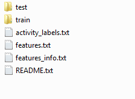

# Coursera Data Science Specialization - Getting and Cleaning Data Project
This is my work for the course project.
The repo contains:
- The run_analysis.R script: it performs the cleaning and analysis of the "_data collected from the accelerometers from the Samsung Galaxy S smartphone_". A complete description of the original data can be found [here](http://archive.ics.uci.edu/ml/datasets/Human+Activity+Recognition+Using+Smartphones). The data itself can be downloaded from [here](https://d396qusza40orc.cloudfront.net/getdata%2Fprojectfiles%2FUCI%20HAR%20Dataset.zip).
- labels.txt file: containing a list of "descriptive variable names" to be used by the above script as column names in the output data.

## Executing the analysis
0. Download the data from the link above and extract it to your file system. We will refer to the path to the data as `DATA_DIR`. This folder must be containing the data as in the picture

1. Download the run_analysis.R and labels.txt files into your working directory

2. Before executing the script, you need to install the **dplyr**. Use `install.packages("dplyr")` if you don't have it already installed.
3. Source the script using: `source("run_analysis.R")`
4. Run the script giving it the `DATA_DIR` value, ex:

     ``result <- run_analysis("C:/ds/UCI HAR Dataset")``
5. The result of the analysis is now in the data frame `result` (or whatever you name it)
A full description of what the code does can be found in the [Code Book](CodeBook.md). (And also in the comments in the source file)
